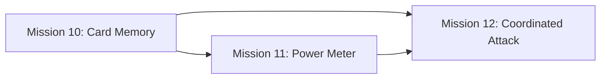

# Missions 10-12: Brain Mastery — Professional Strategy Implementation

Based on the professional Baloot strategy document "Total Information Control."
These 3 missions build on Mission 9 (Al-Ta'sheer Signaling) and transform the bot from a reactive player into a deductive, professional-level agent.

---

## Mission 10: Card Memory System (The Digital Ledger)
**Priority:** 🥇 Critical — Foundation for all advanced play
**Estimated Effort:** Medium-Large

### Goal
Make the bot use the existing `Graveyard` to deduce remaining cards, detect voids, and estimate opponent hand compositions.

### Tasks
1. **Create `ai_worker/strategies/components/card_memory.py`**
   - Build `CardMemory` class that consumes `Graveyard` data
   - Track remaining cards per suit (32-card deck minus played)
   - Track cards played *by each position* (opponent vs partner)
   - Infer suit voids: if a player discarded when they could follow suit → void detected
   - Calculate probability distributions: "Who likely holds the remaining Queen of Spades?"

2. **Integrate into `BotContext`**
   - Add `memory: CardMemory` to context (currently `None`)
   - Populate from `game.graveyard` + `game.round_history` on every decision

3. **Use in strategies**
   - HokumStrategy: check if opponent is void in trump before leading
   - SunStrategy: count remaining cards in each suit before deciding leads
   - Both: detect when it's safe to lead a suit (all higher cards played)

### Key Principle from Document
> "The player who possesses the most granular, real-time knowledge about the status of the unplayed deck inherently gains an insurmountable strategic advantage."

---

## Mission 11: Power Meter (Dynamic Posture Switching)
**Priority:** 🥈 High — Makes the bot adapt mid-round  
**Estimated Effort:** Medium
**Depends on:** Mission 10

### Goal
Count remaining trump power and dynamically switch between aggressive/defensive play style.

### Tasks
1. **Create `ai_worker/strategies/components/power_meter.py`**
   - `TrumpPowerAudit`: count remaining high-trump cards (J, 9, A, 10, K in Hokum order)
   - Track which team has expended power: `opponent_power_spent`, `our_power_remaining`
   - Compute `aggression_score` (0.0-1.0) based on relative power balance

2. **Dynamic posture in strategies**
   - **Defensive posture** (opponent retains power): hold high cards, protect Aces, avoid leading trump
   - **Aggressive posture** (opponent spent power): lead trump to flush remaining, maximize trick acquisition
   - Threshold: switch to aggressive when opponent has spent >60% of their trump power

3. **Integrate with bidding**
   - Post-deal power assessment: if dealt hand has high aggression_score, consider doubling

### Key Principle
> "If the card count confirms that the opponent's team has expended their major trump assets, the AI should immediately transition to an aggressively offensive game plan."

---

## Mission 12: Coordinated Attack + The Clincher
**Priority:** 🥉 High — Team synergy and endgame precision  
**Estimated Effort:** Medium
**Depends on:** Missions 10, 11

### Goal
Complete the signal response loop: read partner signals → respond with maximum force. Add score-aware sacrifice for contract-breaking plays.

### Tasks
1. **Signal Response (Coordinated Attack)**
   - When partner signal detected (from Mission 9 `_check_partner_signals`):
     - Confirm signal against CardMemory (does partner likely have the winner?)
     - If confirmed → play **highest** card in signaled suit, not just any card
   - Track signal confidence: multiple consistent discards = stronger signal

2. **The Clincher (Score-Aware Sacrifice)**
   - Before each play, calculate: how many points does opponent need to fail their contract?
   - If opponent is within 10-20 points of failing:
     - Feed highest-value cards (Ace/10) to partner's winning tricks
     - Sacrifice non-essential power cards to secure remaining tricks
   - If *we* are close to winning: switch to point-maximizing plays

3. **Quwwah Management (Opponent Strength Control)**
   - Use CardMemory to identify opponent's strongest suit
   - Retain control cards in that suit (don't discard them early)
   - If opponent leads their Quwwah suit → play highest to contest, not lowest

### Key Principle
> "When the opponent is strategically close to losing, the AI must execute the strategy of aggressively sacrificing its highest-value card to the partner."

---

## Implementation Order

## Source Reference
- `C:\Users\MiEXCITE\Downloads\To become a professional Baloot player...md`
- `C:\Users\MiEXCITE\Downloads\Advanced Computational Modeling of Al-Ta'sheer Signaling Protocols...md`
