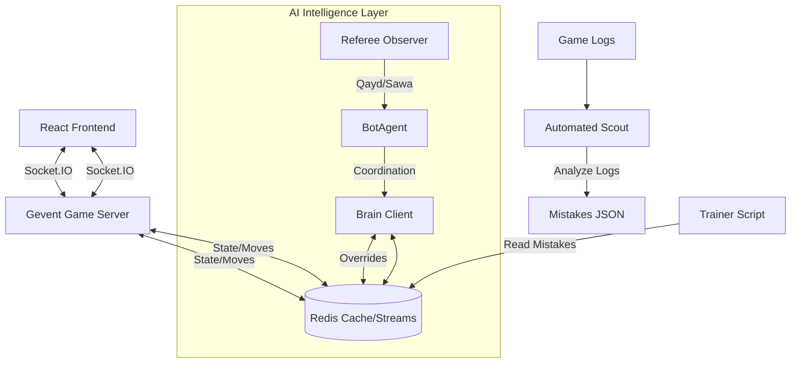

# System Architecture

## Overview
The Baloot Game Project is a modern, high-performance web application designed for real-time multiplayer gaming with advanced AI capabilities. It utilizes a hybrid architecture where a **Fast Game Server** handles real-time interactions, while an **Asynchronous AI Worker** ("The Brain") handles complex intelligence, bridged by **Redis**.

## Key Technologies

### 1. Redis ("The Nervous System")
Redis is the central communication bus.
- **Role**:
    - **Speed**: Stores "Hot" game state for sub-millisecond access.
    - **Reflexes**: Caches common AI decisions (e.g., "Always play Ace on King") to avoid recalculation.
    - **Brain Memory**: Stores "Correct Moves" learned from the Scout.

### 2. Automated Scout ("The Observer")
- **Role**: Batch processes game logs to identify "Losses", sends them to Gemini LLM for analysis, and extracts "Mistakes".
- **Stack**: Python, Gemini Flash (Analysis), Regex Parsing.

### 3. Docker ("The Container")
- **Role**: Ensures Redis and Python dependencies run authentically on any machine.

### 4. AI Worker Components (New)
The monolithic agent has been decomposed into modular components:
- **`BrainClient`**: Handles all Redis connectivity, "Correct Move" lookups, and Flyerwheel data capture.
- **`RefereeObserver`**: Observes the game state for mandatory rule enforcement (e.g., claiming *Sawa* or calling *Qayd* on illegal moves).
- **`BotAgent`**: Acts as a coordinator, delegating to Referee -> Brain -> Strategy in that order.

## Implemented Capabilities

### 🧠 The AI Data Flywheel (Active)
We have built a **Self-Improving System**:
1.  **Scout**: Analyzes logs nightly (or on-demand) to find mistakes.
2.  **Training**: `train_brain.py` pushes corrected moves to Redis using a hash of the game state.
3.  **Bot Agent**: Before using heuristics, the bot checks `brain:correct:{hash}`. If a match is found, it plays the "Grandmaster Move".

### 🎥 'Time Travel' Replay System
Redis Streams can store the exact sequence of events for every active game.
- **Feature**: Users can "REWIND" a live game to see what happened, or watch a replay immediately after a match.
- **Implementation**: The Frontend requests the event stream from Redis, reconstructing the game state locally.

### 🏟️ Massive Spectator Mode
Directly connecting 1000 spectators to a Game Room would crash the server.
- **Solution**: The Game Server pushes updates *once* to Redis Pub/Sub.
- **Scale**: A separate fleet of "Spectator Relays" subscribes to Redis and broadcasts to thousands of users. The main Game Loop is untouched.

## Directory Structure
- `server/`: The core Game Engine and Socket.IO handler.
- `ai_worker/`: The heavy-lifting AI logic (`BrainClient`, `RefereeObserver`, `strategies/`).
- `frontend/`: React UI.
- `docs/`: System documentation.
