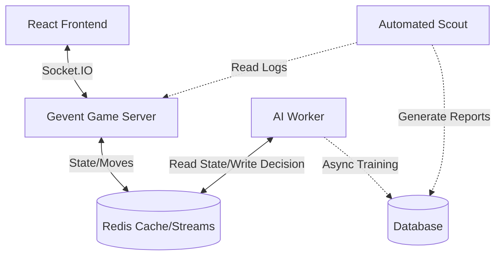

# System Architecture

## Overview
The Baloot Game Project is a modern, high-performance web application designed for real-time multiplayer gaming with advanced AI capabilities. It utilizes a hybrid architecture where a **Fast Game Server** handles real-time interactions, while an **Asynchronous AI Worker** ("The Brain") handles complex intelligence, bridged by **Redis**.

## Key Technologies

### 1. Redis ("The Nervous System")
Redis is not just a cache; it is the central communication bus.
- **Role**:
    - **Speed**: Stores "Hot" game state for sub-millisecond access.
    - **Reflexes**: Caches common AI decisions (e.g., "Always play Ace on King") to avoid recalculation.
    - **Queues**: Buffers game logs and training data for the AI Flywheel.

### 2. Automated Scout ("The Observer")
- **Role**: Batch processes game logs to identify and analyze "Losses" or "Close Games", generating candidate training data for the Brain.
- **Stack**: Python, Gemini 2.0 (Analysis), PowerShell (Orchestrator).

### 3. Docker ("The Container")
- **Role**: Ensures the complex environment (Redis, Python dependencies, potential GPU drivers for AI) runs identically on all developer machines and cloud servers.

## Future Capabilities Initiated by this Stack

By keeping Redis and Docker, we unlock:

### 🧠 The AI Data Flywheel
Instead of static bots, we can build a **Self-Improving System**:
1.  **Live Ingestion**: Every move made by top players is pushed to a Redis Stream.
2.  **Background Training**: A separate Docker container (AI Worker) consumes this stream, fine-tuning the `BotContext` models 24/7 without slowing down the game.
3.  **Hot Swapping**: New models are published to Redis, and Game Servers pick them up instantly.

### 🎥 'Time Travel' Replay System
Redis Streams can store the exact sequence of events for every active game.
- **Feature**: Users can "REWIND" a live game to see what happened, or watch a replay immediately after a match.
- **Implementation**: The Frontend requests the event stream from Redis, reconstructing the game state locally.

### 🏟️ Massive Spectator Mode
Directly connecting 1000 spectators to a Game Room would crash the server.
- **Solution**: The Game Server pushes updates *once* to Redis Pub/Sub.
- **Scale**: A separate fleet of "Spectator Relays" subscribes to Redis and broadcasts to thousands of users. The main Game Loop is untouched.

## Directory Structure
- `server/`: The core Game Engine and Socket.IO handler.
- `ai_worker/` (Planned): The heavy-lifting AI logic.
- `frontend/`: React UI.
- `docs/`: System documentation.
